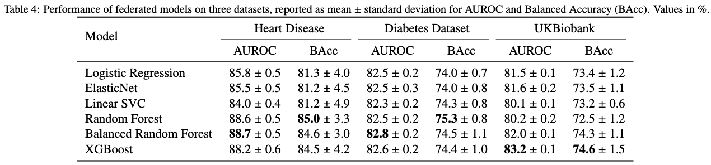
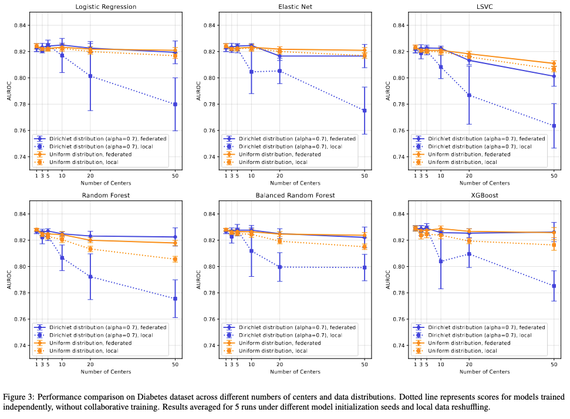
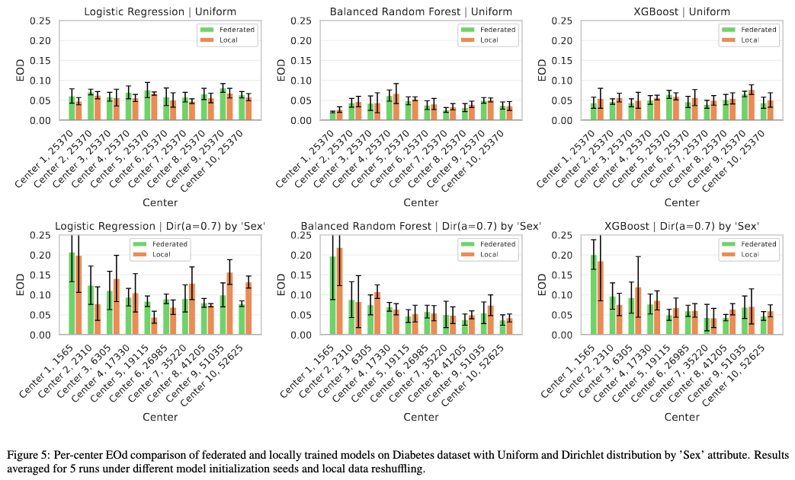

# FLCore
Federated Learning benchmark of classical machine learning models.


[](https://www.python.org/)
[](LICENSE)
[](#)

## 📊 Available federated models
| Model | Aggregation method | Alias | Link |
|---|---|---|---|
|Logistic regression| FedAvg | `logistic_regression` |[flower.dev/docs/framework/quickstart-scikitlearn.html](https://flower.dev/docs/framework/quickstart-scikitlearn.html)|
|Elastic Net| FedAvg |`elastic_net` | [flower.dev/docs/framework/quickstart-scikitlearn.html](https://flower.dev/docs/framework/quickstart-scikitlearn.html) |
|LSVC| FedAvg |`lsvc` | [flower.dev/docs/framework/quickstart-scikitlearn.html](https://flower.dev/docs/framework/quickstart-scikitlearn.html) |
|Random Forest| Custom |`random_forest` | [Random Forest Based on Federated Learning for Intrusion Detection](https://link.springer.com/chapter/10.1007/978-3-031-08333-4_11) |
|Balanced Random Forest| Custom |`balanced_random_forest` | [Random Forest Based on Federated Learning for Intrusion Detection](https://link.springer.com/chapter/10.1007/978-3-031-08333-4_11) |
|XGBoost| FedXgbagging |`xgb` |Derived from Flower's implementation [https://github.com/flwrlabs/flower/tree/main/examples/xgboost-comprehensive](https://github.com/flwrlabs/flower/tree/main/examples/xgboost-comprehensive) and upgraded with client adapted learning rate for stable training |
|XGBoost| FedXgbNnAvg |`xgblr` |[Gradient-less Federated Gradient Boosting Trees with Learnable Learning Rates](https://arxiv.org/abs/2304.07537)|
|Deep Learning | FedAvg |`nn` |[https://flower.dev/docs/framework/tutorial-quickstart-pytorch.html](https://flower.dev/docs/framework/tutorial-quickstart-pytorch.html)|


## 🚀 Quickstart
Install necessary dependencies:
```
pip install -r requirements.txt
```
For lightweight, non-GPU setting consider using:
```
pip install -r requirements_cpu.txt
```
To start a federated training run:
```
python run.py
```
it will automatically start a server and a set of client processes defined in `config.yaml`

### Step by step
Also, you can do it manually by running:
```
python server.py
```
And then, preferably in a separate shell window for clean output, start clients with their corresponding ids:
```
python client.py 1
```
```
python client.py 2
```

## ⚙️ Configuration file
The federated training parameters are defined in ```config.yaml```
The most important parameters are:
 - `num_clients` (number of clients needed in a federated training)
 - `num_rounds` (number of training rounds)
 - `model` (machine learning model with it's federated implementation)

 ## 📊 Benchmarking mode
 Use the `benchmark.py` script for batch benchmarking of all models under same experimental conditions. First, set the array of experiment conditions on top of the script.

 ```
# Number of Clients ablation experiment
experiment_name = "num_clients_ablation"
benchmark_dir = "benchmark_results"
model_names = [
    "logistic_regression",
    "elastic_net",
    "lsvc",
    "random_forest",
    "balanced_random_forest",
    "xgb"
    ]
datasets = ["diabetes"]
num_clients = [1,3,5,10,20,50]
dirichlet_alpha = [0.7, None]
```

After setting the parameters, run the script:
```
python benchmark.py
```
It will run all configurations of parameters and save the results for each model.

 ## 📦 Data loader
To train on your own dataset add a loading method in the `datasets.py` file and a corresponding entry in the `load_dataset()` method.

#### Loading method
 ```python
 XY = Tuple[np.ndarray, np.ndarray]
 Dataset = Tuple[XY, XY]

 def load_my_dataset(data_path, center_id=None) -> Dataset:
 ```

 #### Note
 It is important to note that each client can only use it's subset of data corresponding to it's institution. When deployed in a real federated setting,
 each client will access the available data through the provided `data_path` in `config.yaml` file. To enable this behaviour in simulated setting,
 a dataset loading method should accept `center_id` argument in order to load only a specific part of a dataset and simulate distributed data scheme.


## 📈 Model performance

General performance comparison between all implemented models on three datasets.



### 🧩 Data fragmentation ablation
 Models behaviour under different data fragmentation strategies (`dirichlet_alpha: 0.7`) and number of clients (`num_clients`) from 1-50 on public Diabetes dataset.



### ⚖️ Fairness analysis example
Sample comparison of how distribution strategies affect fairness metrics based on the selected `config` attribute:

`parititon_by_attribute: 'Sex'`




 ## 🤝 Contributing
 To add a new model to the framework two methods need to be implemented:
 #### For server side:

 ```python
 def get_server_and_strategy(config, data = None) -> Tuple[Optional[flwr.server.Server], flwr.server.strategy.Strategy]:
 ```
 which returns Flower Server object (optional) and Flower Strategy object.

#### For client side:

 ```python
 def get_client(config, data) -> flwr.client.Client:
 ```
 This method should return the initialized client with data loaded specifically for this data center.

#### Contribution steps
After implementing the necessary methods follow the remaining steps:
1. Create a new branch in `flcore` repository
2. Copy your model package to `flcore/models` directory
3. Add cases for the new model in `server_selector.py` and `client_selector.py` modules in `flcore/` directory
4. Add the model to the available models table in `README.md` file
5. Open a Pull Request and wait for review
